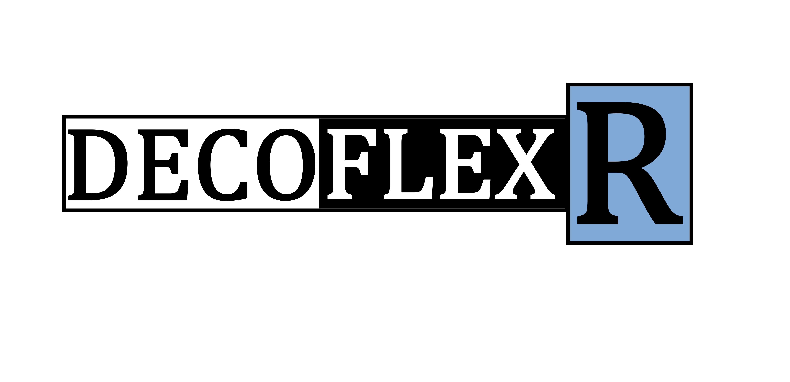

[](https://github.com/crhisto/DecoFlex/actions/workflows/r_check.yaml)
[](https://github.com/crhisto/DecoFlex/actions/workflows/test-coverage.yaml)

<!-- Diagram with NMMFlex -->
<br />
<div align="center">
    
</div>

# DecoFlex

DecoFlex is an innovative deconvolution method for Omic data, implemented as DecoFlexR in R and presented as an R package.


## Overview

DecoFlexR is a versatile tool that uses a unique deconvolution method to parse Omic data, providing insights and understanding of complex biological systems. Accompanied by the DecoFlexRData package, which includes a range of datasets used in our related research paper, DecoFlexR is a comprehensive toolkit for advanced genomic research.

<!-- Diagram with NMMFlex -->
<br />
<div align="center">
    
</div>

## Prerequisite Setup

Before installing the `DecoFlex` package, there are several steps required to prepare your system with the necessary environments and dependencies. Follow the instructions below for the smooth installation of the `DecoFlex` package.

1. Install the latest version of conda from the official website: [Conda Installation](https://docs.conda.io/projects/conda/en/23.3.x/user-guide/install/index.html)

2. Initiate a new conda environment named 'r_DecoFlex' using the commands provided below in your console. It is advisable to use Python version 3.8 or above if your operating system is up-to-date. However, if your OS isn't the latest version, Python 3.7 would be a more suitable choice:
   
   ```bash
   conda create -n r_DecoFlex python=3.9 anaconda
   conda activate r_DecoFlex
   ```

   To deactivate the environment, use:

   ```bash
   conda deactivate
   ```

3. In the latest version of RStudio (>2021) configure your environment to have the python path correctly. If you're using RStudio, navigate to: `RStudio > Tools > Global Options > Python > Select [Conda Environments]` and choose the conda environment that you just created named `r_DecoFlex`.

4. To proceed, you need to install the Python library [NMMFlex](https://github.com/crhisto/NMMFlex). You have the option to clone the GitHub repository directly. After doing so, in the subsequent step, replace the term `github_repository` with the actual path of your cloned repository.

5. Check the conda directory usually `/home/[user_name]/miniconda3/bin/conda`: 

   ```bash
   which conda
   ```
   
6. If you are working in a ubuntu linux OS-like, make sure you have installed the lib: libstdc++6: 

   ```bash
   sudo apt-get update
   sudo apt-get install libstdc++6
   ```

7. Make sure you have installed the following conda libraries: 

   ```R
   reticulate::py_install(envname="/home/ubuntu/miniconda3/envs/r_DecoFlex", packages="pyqtwebengine", pip=TRUE)
   reticulate::py_install(envname="/home/ubuntu/miniconda3/envs/r_DecoFlex", packages="pyqt5", pip=TRUE)
   ```

8. Activate the environment in R and install the library replacing the `conda directory` and the `github_repository` path:

   ```R
   library(reticulate)
   reticulate::use_condaenv(condaenv = "r_DecoFlex", conda = "/Users/[username]/miniconda3/bin/conda")
   reticulate::py_install(packages="[github_repository]/NMMFlex/NMMFlexPy", pip=TRUE)
   ```
   
   Also change the directory miniconda3 if you installed anaconda3 instead.

## Additional Dependencies

The DecoFlex package is designed to support large-scale scRNA-seq datasets. To effectively manage these datasets, particularly those represented as sparse matrices (dgCMatrix), we leverage specific libraries to enhance performance and efficiency. 

Here are the required additional libraries you'll need:

1. **Biobase**: This package provides a foundational structure for representing biological data in R. It's an essential library for managing and processing large-scale biological data. You can install the custom version we utilize for DecoFlex from the following GitHub repository: [Biobase: https://github.com/crhisto/Biobase](https://github.com/crhisto/Biobase).

2. **xbioc**: This is another crucial package that provides tools for handling, processing, and analyzing biological data. It extends Biobase's functionality and is necessary for handling sparse matrices in DecoFlex. Install the package from this repository: [xbioc: https://github.com/crhisto/xbioc](https://github.com/crhisto/xbioc).

Ensure to install these libraries to get the best out of your DecoFlex experience.

## R library Installation

You can install the `DecoFlex` package from either GitHub or Bioconductor.

### GitHub

To install the `DecoFlex` package from GitHub, you need to have the `devtools` package installed in your R environment. If you do not have `devtools` installed, you can install it by running:

```R
install.packages("devtools")
```

After installing `devtools`, you can install `DecoFlex` from GitHub by running:

```R
devtools::install_github("crhisto/DecoFlex")
```

### Bioconductor

To install the `DecoFlex` package from Bioconductor, you need to have the `BiocManager` package installed in your R environment. If you do not have `BiocManager` installed, you can install it by running:

```R
install.packages("BiocManager")
```

After installing `BiocManager`, you can install `DecoFlex` from Bioconductor by running:

```R
BiocManager::install("DecoFlex")
```

After the installation is complete, you can load the `DecoFlex` package in an R session using:

```R
library(DecoFlex)
```

Now you are ready to use `DecoFlex` for your data analysis tasks!


## Documentation Generation:

The `DecoFlex` package utilizes the `pkgdown` library to generate its html documentation. `pkgdown` is a powerful tool that converts your documentation into a beautiful website. To regenerate the `DecoFlex` documentation, follow these steps:

```R
# Check for pkgdown library, install if not present
if(!"pkgdown" %in% rownames(installed.packages())){
  install.packages("pkgdown")
}

# Load the pkgdown library
library(pkgdown)

# Configure your package to utilize pkgdown
usethis::use_pkgdown()

# Generate the comprehensive package documentation
pkgdown::build_site()
```

Upon completion, a full version of the documentation, inclusive of detailed information about every R module and function, will be compiled. This makes for a valuable resource to get to know the package and its functionalities. You can find this detailed documentation at the following [link](https://www.github.com/crhisto/DecoFlex/DecoFlexR/DecoFlex/docs/index.html).

### Manual Documentation

For a detailed guide to using the DecoFlex package, we provide comprehensive manual documentation in a downloadable PDF format. 

You can generate this documentation locally with the following command in your terminal:

```bash
R CMD Rd2pdf --output='docs/DecoFlex_manual_documentation.pdf' "GitHub/DecoFlex/DecoFlexR/"
```

Please adjust the path to match the location of the DecoFlex package on your local system.

For your convenience, we also host the PDF documentation online. To access the DecoFlex Manual Documentation, simply follow this [link](DecoFlexR/docs/DecoFlex_manual_documentation.pdf).

## Running the Main Functions

DecoFlex offers two core functionalities: Automatic Tree Discovery and Tree-guided Deconvolution. These features are constructed based on the NMMFlexPy framework, available at [NMMFlex GitHub](www.github.com/crhisto/NMMFLex/). The major functions included in the package are: `hierachy_selection_plus_deconvolution`, `run_deconvolution_simulation_generic_recursive` and `run_deconvolution_tree_guided_recursive`. Here's a brief explanation of each function and an example of how to use them.

### 1. Hierarchy Selection Plus Deconvolution

This function executes the clustering method and the deconvolution process on the provided single-cell expression data.

```R
hierachy_selection_plus_deconvolution(
  single_cell_data_exp, 
  var_cell_type,
  subset_celltypes = NULL, 
  var_sample,
  number_clusters_one_celltype = 1,
  distance_method = 'euclidean',
  hclust_method = "average",
  min_size_leaf = 3,
  max_k_tried_hier_clustering = 3,
  random_seed = NULL,
  use_min_cor_strategy = TRUE,
  delete_shared_level_markers = FALSE,
  delete_shared_internal_markers = FALSE,
  filter_markers = NULL,
  param.logfc.threshold = 2.0,
  param.p_val_adj = 0.05,
  filter_main_markers = TRUE,
  verbose = FALSE
)
```
**Parameters:**

- `single_cell_data_exp`: A data frame or matrix containing single-cell expression data.
- `var_cell_type`: A vector or factor indicating the cell type for each cell.
- `subset_celltypes`: A vector of cell types to subset for the analysis. By default, all cell types are used.
- `var_sample`: A vector or factor indicating the sample source for each cell.
- `number_clusters_one_celltype`: The number of clusters for each cell type. Default is 1.
- And more...

**Return:**

A list containing results of the clustering and deconvolution process.

### 2. Run Deconvolution Tree Guided Recursively

This function utilizes a tree-guided approach to perform a recursive deconvolution on bulk and single-cell data. The recursive method aids in the analysis of hierarchically structured data, often found in biological systems where a group of cell types are hierarchically organized based on their molecular similarity. The process starts at the top level, identifies clusters, computes markers, performs deconvolution, and sends the information back to guide the deconvolution at the next level.

```R
run_deconvolution_tree_guided_recursive(
  result_deco_top = NULL,
  bulk_data,
  true_proportions = NULL,
  single_cell_data_exp,
  sub_clusters_var,
  hierarchy,
  sample,
  use_min_cor_strategy = TRUE,
  delete_shared_level_markers = FALSE,
  delete_shared_internal_markers = FALSE,
  deconvolute_just_top = FALSE,
  deconvolute_top_hierarchy_limit = 1,
  filter_markers = NULL,
  param.logfc.threshold = 2.0,
  param.p_val_adj = 0.05,
  test.use.value = 'wilcox',
  marker_strategy = NULL,
  verbose = FALSE
)
```
**Parameters:**

- `result_deco_top`: A list representing the result of deconvolution at the top level of the hierarchy. If NULL (default), the function starts at the root of the tree.
- `bulk_data`: The bulk data on which the deconvolution needs to be performed.
- `true_proportions`: An optional matrix representing the true proportions of cell types. This can be used to calculate the accuracy of the deconvolution. If NULL (default), the accuracy calculation is skipped.
- `single_cell_data_exp`: A data frame representing single cell expression data, used to guide the deconvolution process.
- `sub_clusters_var`: A string representing the variable in single_cell_data_exp which indicates sub-clusters.
- And more...

**Return:**

A list containing the result of the top level deconvolution, a list of deconvolution results at each level, and the back-propagated proportions at the top level.

### 3. Run Deconvolution Simulation Generic Recursive

This function performs a recursive deconvolution simulation on the given single-cell data. It first handles the top node of the hierarchy and then sends the rest to the recursive algorithm for further processing.

```R
run_deconvolution_simulation_generic_recursive(
  single_cell_data_exp,
  hierarchy,
  sub_clusters_var,
  sample,
  use_min_cor_strategy = TRUE,
  delete_shared_level_markers = FALSE,
  delete_shared_internal_markers = FALSE,
  deconvolute_just_top = FALSE,
  filter_markers = NULL,
  param.logfc.threshold = 2.0,
  param.p_val_adj = 0.05,
  marker_strategy = NULL,
  verbose = FALSE
)
```

**Parameters:**

- `single_cell_data_exp`: A data frame containing single cell expression data.
- `hierarchy`: A list outlining the hierarchy of cell types.
- `sub_clusters_var`: A variable representing the subclusters in the data.
- `sample`: A variable representing the samples in the data.
- `use_min_cor_strategy`: A logical parameter indicating whether to use the minimum correlation strategy. Default is TRUE.
- `delete_shared_level_markers`: A logical parameter indicating whether to delete shared level markers. Default is FALSE.
- `delete_shared_internal_markers`: A logical parameter indicating whether to delete shared internal markers. Default is FALSE.
- And more...

**Return:**

A list containing the deconvolution result and the pseudo bulk data.

## Running additional Functions

In addition, DecoFlex provides utilities for running generic deconvolutions. It acts as a wrapper to the [NMMFlexPy](www.github.com/crhisto/NMMFlex/) library, providing additional functions including `run_complete_deconvolution` and `run_grid_search`.

Below is a brief overview of each function and an example of how to use them:

### 1. Run complete deconvolution

`run_complete_deconvolution` performs deconvolution using three input matrices. It's capable of handling both complete and partial models, depending on the inputs and outputs.

Here is an example of how to use it:

```R
run_complete_deconvolution(
  x_matrix,     # A matrix, Input matrix corresponding to a dataframe.
  y_matrix,     # A matrix or NULL, Input matrix.
  z_matrix,     # A matrix or NULL, Input matrix.
  k             # An integer, The rank used for deconvolution.
  # ...other parameters...
)
```

### Parameters:

- `x_matrix`: A matrix, Input matrix corresponding to a dataframe.
- `y_matrix`: A matrix or NULL, Input matrix.
- `z_matrix`: A matrix or NULL, Input matrix.
- `k`: An integer, The rank used for deconvolution.
- `gamma`: A numeric, The gamma parameter value. Default is 1.
- `alpha`: A numeric, The alpha parameter value. Default is 0.0.
- `beta`: A numeric, The beta parameter value. Default is 0.0.
- `delta_threshold`: A numeric, The convergence threshold for stopping the deconvolution iterations. Default is 1e-10.
- `max_iterations`: An integer, The maximum number of iterations to perform during deconvolution. Default is 200.
- `print_limit`: An integer, The iteration interval at which to print progress messages during deconvolution. Default is 100.
- `proportion_constraint_h`: A logical, Whether to apply a proportion constraint to matrix H. Default is TRUE.
- `regularize_w`: A matrix or NULL, The regularization matrix for W. Default is NULL.
- `alpha_regularizer_w`: A numeric, The alpha regularization parameter for W. Default is 0.
- `fixed_w`: A matrix or NULL, The fixed matrix for W. Default is NULL.
- `fixed_h`: A matrix or NULL, The fixed matrix for H. Default is NULL.
- `fixed_a`: A matrix or NULL, The fixed matrix for A. Default is NULL.
- `fixed_b`: A matrix or NULL, The fixed matrix for B. Default is NULL.
- `initialized_w`: A matrix or NULL, The initial value for W. Default is NULL.
- `initialized_h`: A matrix or NULL, The initial value for H. Default is NULL.
- `initialized_a`: A matrix or NULL, The initial value for A. Default is NULL.
- `initialized_b`: A matrix or NULL, The initial value for B. Default is NULL.
- `init_method_w`: A string, The initialization method for W. Default is 'random_based.uniform'.
- `init_method_h`: A string, The initialization method for H. Default is 'random_based.uniform'.
- `init_method_a`: A string, The initialization method for A. Default is 'random_based.uniform'.
- `init_method_b`: A string, The initialization method for B. Default is 'random_based.uniform'.
- `verbose`: A logical, Whether to display progress messages during deconvolution. Default is TRUE.

### Return:

The function returns a deconvoluted matrix after performing the operations defined by the function's parameters.

### 2. Run grid search

`run_grid_search` performs a grid search in a parallelized manner over different values of alpha and beta in the non-negative matrix factorization. The search is conducted over the combinations of given alpha and beta values.

Here is an example of how to use it:

```R
run_grid_search(
  bulk_data_methylation,     # A data.frame, Bulk data methylation matrix.
  bulk_data_expression,      # A data.frame, Bulk data expression matrix.
  data_expression_auxiliary, # A data.frame, Auxiliary expression data matrix.
  k                          # An integer, Number of clusters.
  # ...other parameters...
)
```

### Parameters:

- `bulk_data_methylation`: A data.frame, Bulk data methylation matrix.
- `bulk_data_expression`: A data.frame, Bulk data expression matrix.
- `data_expression_auxiliary`: A data.frame, Auxiliary expression data matrix.
- `k`: An integer, Number of clusters.
- `alpha_list`: A list of numerics, List of alpha values to be considered in the grid search. If NULL, no grid search is performed over alpha values.
- `beta_list`: A list of numerics, List of beta values to be considered in the grid search. If NULL, no grid search is performed over beta values.
- `delta_threshold`: A numeric, The threshold value for convergence. Default is 1e-20.
- `max_iterations`: An integer, Maximum number of iterations for convergence. Default is 200
- `print_limit`: An integer, Limit for print statements. Default is 100.
- `threads`: An integer, Number of CPU threads to be used. If 0, then it uses the total number of CPUs minus one. Default is 0.
- `proportion_constraint_h`: A logical, Whether to apply proportion constraint on H matrix. Default is TRUE.
- `regularize_w`: A logical, Whether to apply regularization on W matrix. If NULL, no regularization is applied.
- `alpha_regularizer_w_list`: A list of numerics, List of alpha regularizer values to be considered in the grid search. If NULL, no grid search is performed over alpha regularizer values.
- `fixed_w`: A matrix or NULL, Fixed matrix W. If NULL, it implies that W is not fixed.
- `fixed_h`: A matrix or NULL, Fixed matrix H. If NULL, it implies that H is not fixed.
- `fixed_a`: A matrix or NULL, Fixed matrix A. If NULL, it implies that A is not fixed.
- `fixed_b`: A matrix or NULL, Fixed matrix B. If NULL, it implies that B is not fixed.

### Return:

The function returns a list of results from the grid search. Each result contains the performance details of the model with different combinations of alpha and beta values.

Check the function's documentation for a detailed description of each parameter and expected return. 

### Notes and recommendations

1. When preparing your references and bulk input data, ensure that sample names do not start with a numeric character. In certain scenarios, R prefixes the column names with 'X' when they start with a number, which can potentially lead to complications during the execution of procedures.
2. If you encounter the error message: `There are no marker genes identified for the current process. Please verify the value assigned to the parameter 'logfc.threshold'. If necessary, consider using a smaller value. The current value is: xx.xx`, it suggests that you may need to adjust the `logfc.threshold` parameter. The default setting for this parameter is 2.0. Lowering the `logfc.threshold` value doesn't mean all genes beyond this threshold are included in the calculation. Rather, it widens the pool of genes that the algorithm can consider. The algorithm then identifies an optimal subset of these genes to minimize the correlation between samples."

## DecoFlexRData

This package contains all the datasets that have been used in our related research paper.

## Vignettes: Exploring Data with Sample Analyses

`DecoFlex` has been designed and developed as a comprehensive tool for performing intricate analyses on various datasets. The vignettes examples provided below showcase some of the salient applications where `DecoFlex` has been successfully employed for deconvolution:

1. **Breast Cancer Data - Deconvolution of Methylation Core with Expression Data**: This case study provides a glimpse of how `DecoFlex` can navigate through complex breast cancer data, conducting a methylation core deconvolution with associated expression data. For a detailed walkthrough of the analysis, kindly refer to this [R Notebook](DecoFlexR/docs/articles/DecoFlex_breast_cancer_methylation_core.html).

2. **Thymus Cancer Case - T-cell–specific Lymphoma Analysis with Expression Core Deconvolution and Methylation**: Here, `DecoFlex` is employed to examine a dataset centered on T-cell–specific lymphoma in the thymus. The analysis explores a unique combination of expression core deconvolution and methylation analysis. For a comprehensive understanding of the analysis, please follow this [R Notebook](DecoFlexR/docs/articles/DecoFlex_thymus_tumor_NPM-ALK_expression_core.html).

These examples serve as an excellent primer to comprehend the capabilities of `DecoFlex` in handling complex omics data analyses. They could also act as a template for conducting your own unique analyses with your datasets. For any queries, feedback, or suggestions, please feel free to reach out to us.

## Running Test Cases and Code Coverage Analysis

Testing is an integral part of maintaining a robust codebase. `DecoFlex` includes a suite of tests that you can run to ensure the functionality of the package. Furthermore, you can analyze code coverage to ascertain the percentage of the codebase that is executed while the tests are running.

### Running Tests

To run the tests, follow these steps:

1. Navigate to the `DecoFlex` root directory in your console.

2. Open an R session in your console by simply typing `R`.

3. Inside the R session, use the `devtools::test()` function to run the tests:

```R
devtools::test()
```
This will execute all the test cases included in the `DecoFlex` package.

We used [testthat](https://testthat.r-lib.org/) for the creation of the unit test: 

```R
usethis::use_test("name_test_case")
```


### Code Coverage Analysis

Code coverage shows you how much of your code is covered by your tests. It's a useful way of making sure that your tests are thorough and that they touch every part of your code. To run code coverage analysis in `DecoFlex`, follow these steps:

1. Open an R session in your console by simply typing `R`.

2. Install the `covr` package if you haven't done so:

```R
if (!requireNamespace("covr", quietly = TRUE)) {
  install.packages("covr")
}
```

3. Run the following command to execute the code coverage:

```R
covr::package_coverage()
```
This will provide a percentage score of your code coverage, indicating the proportion of your code that was run during your tests.

By routinely running these tests and analyzing your code coverage, you can ensure the reliability and robustness of the `DecoFlex` package.

## CI Pipeline

The project has a CI pipeline configured in GitHub Actions using [Tidyverse R actions](https://github.com/r-lib/actions) . The pipeline performs the following steps:

1. **Install Dependencies**: Installs the project dependencies required for the build process both OS and R software.
2. **Check-r-package**: Runs the internal linter to check for any code style or formatting issues in addition to extra verifications such: --as-cran
3. **Run Unit Tests**: Executes all the unit tests to ensure the functionality of the project.
4. **Calculate Test Coverage**: Measures the test coverage of the project to assess code quality.

In all cases it doesn't generate vignettes or manual

## Citing our Work
If this NMMF implementation proves valuable for your research or projects, we kindly ask you to cite our work in your publications, as per the following:
- Cardona, C., & Schweikert, G. et al (2024). DecoFlex: a flexible joined cell-type decomposition with multiomic epigenetic data. (Manuscript in the process of review for submission and forthcoming publication).

## Contributing
We warmly welcome contributions to the development of our NMMF algorithm implementation. If you discover any issues, have recommendations for enhancements, or wish to contribute new features, please feel free to open an issue or submit a pull request.

## Licensing
This project falls under the GNU General Public License (GPL). The full license text can be found within the [LICENSE](./LICENSE) file.

## Reach Out
Should you have any inquiries or require further assistance, we encourage you to get in touch:
- Crhistian Cardona: [crhisto@gmail.com](mailto:crhisto@gmail.com)

We truly appreciate your interest in our DecoFlex algorithm implementation and eagerly look forward to your feedback.

Happy coding!
